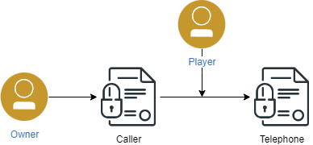
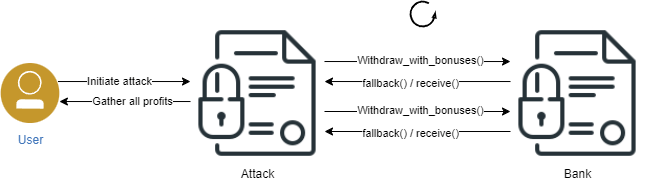

# CTF

## Telephone
In this task, we need to change the ownership of the contract under test.

```solidity
function changeOwner(address _owner) public {
        if (tx.origin != msg.sender) {
            owner = _owner;
        }
    }
```

We can easily observer that we need the tx.origin to be different from msg.sender. This points to the fact that we need a chained call with another contract in order to achieve such functionality.

This is why we create a new contract - [Caller.sol](/contracts/Caller.sol), which will act as a gateway.



## Timezone
In this challenge, we need to use `delegatecall` in order to gain ownership of the original contract. `delegatecall` gives the opportunity to call an external function from another contract while using the storage from the original contract, which has initiated the call. Using this method, we can change the owner of the contract.

## Bank
In order to steal all the money from the `Bank` contract, we need to make a Re-entrancy attack on the Bank. This can be achieved because the `Bank` contract has a vulnerability - it updates the state after sending the ammount to the address (inside the `withdraw_with_bonus()` function): 

```solidity
uint256 rewards = _bonuses_for_users[msg.sender];
        if (rewards > 0) {
            address(msg.sender).call{value: rewards, gas: 1000000}("");
            totalBonusesPaid += rewards;
            _bonuses_for_users[msg.sender] = 0;
        }
```

This means that we can have a maliscious advantage when withdrawing bonuses.



In order for the attack to success and to withdraw all the funds from the Bank, we need to follow these requirements for the transactions:
- We need to first add money to the Bank contract.
- We need to add a bonus for our attacker. The bonus should be less than the total balance of the contract in this moment, otherwise the transactions will no succeed. Ideally, the bonus ammound should divide the contract ammount with a remainder of 0, in order to get all funds out of the Bank.

## Coin
In order to get all the money out of the `Coin` contract, we begin by analyzing its internals.

The most important part of the contract is the `transfer` function and its modifier `lockTokens`:

```solidity
function transfer(
        address _to,
        uint256 _value
    ) public override lockTokens returns (bool) {
        super.transfer(_to, _value);
    }

    modifier lockTokens() {
        if (msg.sender == player) {
            require(block.timestamp > timeLock, "Requirement not met.");
            _;
        } else {
            _;
        }
    }
```

We clearly see that we cannot just use the `transfer` function in order to drain the contract because the modifier will only allow us to do this in 10 years, which is not feesable for us. Everyone loves fast wins.

The key to getting the money out of the contract is observing that it implements the ERC20 interface, which provides other methods for getting money out of contracts - namely, the `transferFrom()` function.

It allows sending a specified amount of tokens from an addresss to another one. Since this function doesn't have the same modifier, therefore, there is no limitation. A key takaway from this CTF task is to always keep an eye on all the functions when implementing an interface because if not overriden, they can provide unsecurred access to data in our contract.