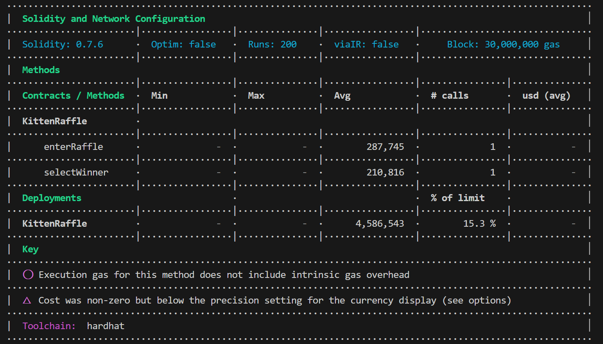
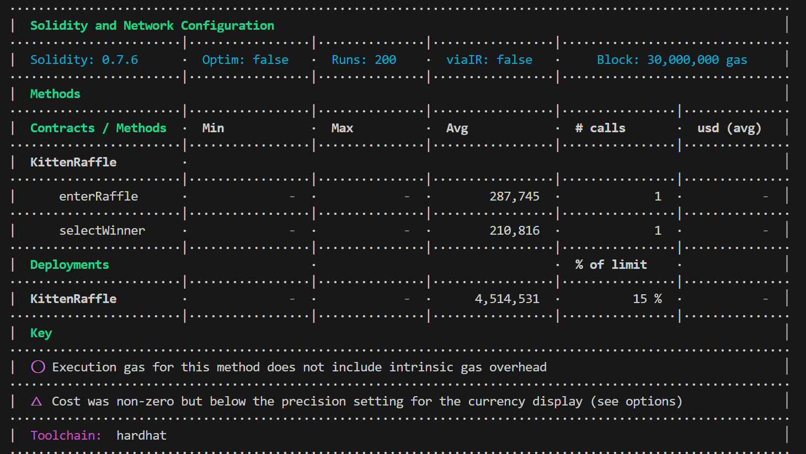

<!-- Your report starts here! -->

Lead Auditors:

- Dzhalev Pavel, dzhalev.pavel@gmail.com

# Table of Contents

- [Table of Contents](#table-of-contents)
- [Protocol Summary](#protocol-summary)
- [Disclaimer](#disclaimer)
- [Risk Classification](#risk-classification)
- [Audit Details](#audit-details)
  - [Scope](#scope)
- [Executive Summary](#executive-summary)
  - [Issues found](#issues-found)
- [Findings](#findings)
- [High](#high)
- [Medium](#medium)
- [Low](#low)
- [Informational](#informational)
- [Gas](#gas)

# Protocol Summary

The smart contract under audit allows the partcicipation in an NFT raffle event for different players.

# Disclaimer

The HSE web3 team makes all effort to find as many vulnerabilities in the code in the given time period, but holds no responsibilities for the findings provided in this document. A security audit by the team is not an endorsement of the underlying business or product. The audit was time-boxed and the review of the code was solely on the security aspects of the Solidity implementation of the contracts.

# Risk Classification

|            |        | Impact |        |     |
| ---------- | ------ | ------ | ------ | --- |
|            |        | High   | Medium | Low |
|            | High   | H      | H/M    | M   |
| Likelihood | Medium | H/M    | M      | M/L |
|            | Low    | M      | M/L    | L   |

We use the [CodeHawks](https://docs.codehawks.com/hawks-auditors/how-to-evaluate-a-finding-severity) severity matrix to determine severity. See the documentation for more details.

All vulnerabilities discovered during the audit are classified based on their potential severity and have the following classification:

| Severity | Description                                                                                                                                                                                                                |
| -------- | -------------------------------------------------------------------------------------------------------------------------------------------------------------------------------------------------------------------------- |
| High     | Bugs leading to assets theft, fund access locking, or any other loss of funds and bugs that can trigger a contract failure. Further recovery is possible only by manual modification of the contract state or replacement. |
| Medium   | Bugs that can break the intended contract logic or expose it to DoS attacks, but do not cause direct loss funds.                                                                                                           |
| Low      | Bugs that do not have a significant immediate impact and could be easily fixed.                                                                                                                                            |
| Gas      | Bugs that are tied to unnecessary wasted gas.                                                                                                                                                                              |

# Audit Details

## Scope

- KittenRaffle.sol

# Executive Summary

## Issues found

| Severity | # of Findings |
| -------- | ------------- |
| CRITICAL |      1         |
| HIGH     |      2         |
| MEDIUM   |       0        |
| LOW      |        1       |

# Findings

# High

## Re-entrancy in `refund()`

Location: `KittenRaffle.sol:#123`

### Description
Re-entrancy can be caused if the state of the contract is updated after the transactions get executed. In `KittenRaffle.sol` we have a possibility for re-entrancy in the `refund()` function. Any interaction from a contract (A) with another contract (B) and any transfer of Ether hands over control to that contract (B). This makes it possible for B to call back into A before this interaction is completed.

### Recommendation
To avoid re-entrancy, you can use the Checks-Effects-Interactions pattern as outlined further below:

```solidity
players[playerIndex] = address(0);
payable(msg.sender).sendValue(entranceFee);
emit RaffleRefunded(playerAddress);
```

### POC
See [`KittenRaffle.js:#31`](/test/KittenRaffle.js)

## Weak PRNG

Location: `KittenRaffle.sol:#148`

The product uses a Pseudo-Random Number Generator (PRNG) in a security context, but the PRNG's algorithm is not cryptographically strong.

### Description
When a non-cryptographic PRNG is used in a cryptographic context, it can expose the cryptography to certain types of attacks.

Often a pseudo-random number generator (PRNG) is not designed for cryptography. Sometimes a mediocre source of randomness is sufficient or preferable for algorithms that use random numbers. Weak generators generally take less processing power and/or do not use the precious, finite, entropy sources on a system. While such PRNGs might have very useful features, these same features could be used to break the cryptography.

### Recommendation
Do not use `block.timestamp`, `now` or `blockhash` as a source of randomness. 

Secure randomness on the blockchain is hard. One can use Chainlink's VRF oracles instead, or rely on Ethereum's new PREVRANDAO opcode. Note that if the contract is deployed on other blockchains, the opcode will have the old DIFFICULTY semantics, which is also not secure.

### POC

## SelectWinner lacks overflow check

Location: `KittenRaffle.sol:#163`

Solidity compiler versions <0.8.0 don't integrate underflow/overflow protection of mathematical operations by default.

### Description
Overflow is when you run out of bits to the left as a result of a math operation. Underflow is when you run out of bits to the right. This can result in unwanted and unpredictable state of the contract, which can be used by malisciout users to retrieve funds.

### Recommendation
When using solidity version <0.8.0, integrate OpenZeppelin's SafeMath library for mathematical operations. From solidity version 0.8.0 onwards, solidity integrates SafeMath natively. Keep in mind that this slightly increases gas usage, but is in general the preferred solution.

### POC

# Medium

# Low

## NewFeeAddress lacks zero check

Location: `KittenRaffle.sol:#206`

### Description
Contract allows for setting the `newFeeAddress` to zero. Afterwards, when the `withdrawFees()` function is executed, the fees to withdraw are permanently lost. Estimates that currently there are more than 900,000ETH lost forever due to such errors. Though this doesn't affect the normal functionality of the contract, it can lead to unwanted consequences for the raffle organizers.

### Recommendation
Add a zero check, similar to OpenZeppelin's Ownable contract's function `transferOwnership()`:

```solidity
function transferOwnership(address newOwner) public virtual onlyOwner {
        require(newOwner != address(0), "Ownable: new owner is the zero address");
        emit OwnershipTransferred(_owner, newOwner);
        _owner = newOwner;
    }
```

### POC

# Gas

## Unchanged variables should be `immutable` or `constant`

### Description
In Solidity variables, which are not changing should be marked as `immutable` or `constant`. These variables are integrated into the contract's bytecode and don't require space in the memory.

### Recommendation
Change variables to constant if they are not updated.

### POC
Change of variables `commonImageUri`, `commonImageUri`, `legendaryImageUri` to constant yielded a 72,012 gas optimisation:

### Before:


### After:



